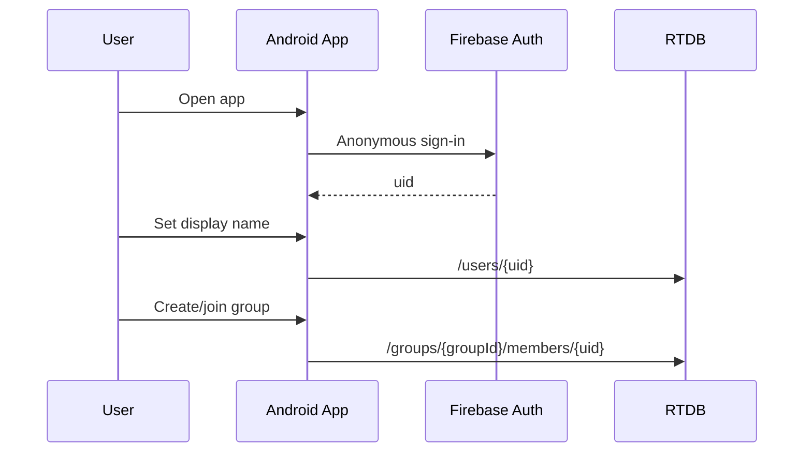
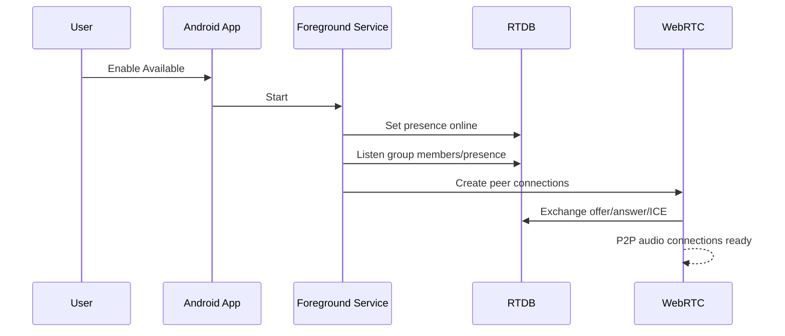
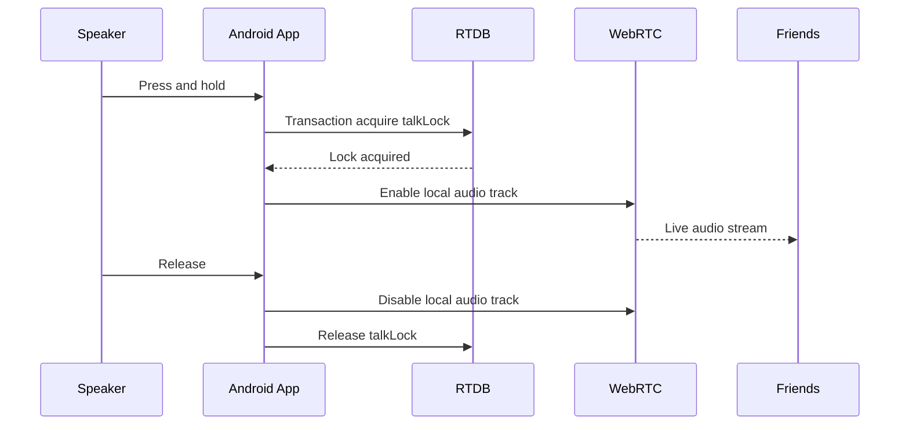
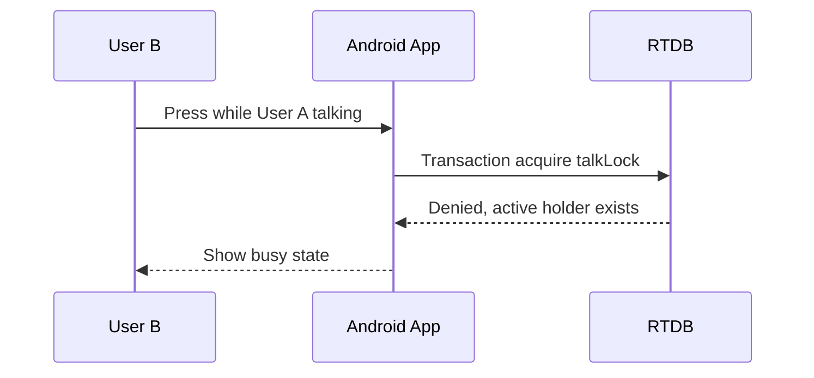

# Android Walkie-Talkie App Technical Plan

## Feasibility Summary

An Android-only push-to-talk app for a private group of four friends is feasible at zero monthly cost.

Strictly free constraints:

- Distribute the APK directly instead of using Google Play. A Google Play developer account has a one-time fee.
- Use Firebase Spark/free tier for auth, realtime database, signaling, and presence.
- Keep an Android foreground service running for instant receive behavior.
- Use WebRTC peer-to-peer for actual audio.
- Use STUN for NAT traversal.
- Optionally run TURN using `coturn` on an Oracle Cloud Always Free VM for better reliability.
- Do not store audio recordings unless explicitly needed.

Firebase Realtime Database free tier is enough for this scale: 100 simultaneous connections, 1 GB stored, and about 10 GB/month downloaded. Firebase Cloud Messaging is no-cost, but sending FCM from a trusted backend requires either Cloud Functions or your own backend. Cloud Functions has no-cost quotas but generally requires billing to be enabled.

Reference links:

- Firebase pricing: https://firebase.google.com/pricing
- Firebase Cloud Messaging: https://firebase.google.com/products/cloud-messaging
- Android foreground service restrictions: https://developer.android.com/develop/background-work/services/fgs/restrictions-bg-start
- Oracle Always Free: https://docs.oracle.com/en-us/iaas/Content/FreeTier/freetier_topic-Always_Free_Resources.htm

## Problem Statement

Build a private Android walkie-talkie app for four friends.

Users join one group. When one user presses and holds a talk button, their voice should play on the other friends' Android phones in near real time. The MVP supports only one active speaker at a time.

## Overall General Solution

Use a native Android app with a foreground service that keeps each device available for incoming audio.

Recommended stack:

- Android: Kotlin, Jetpack Compose, Coroutines/Flow
- Audio transport: WebRTC mesh peer-to-peer
- WebRTC Android library: `io.github.webrtc-sdk:android`
- Signaling, presence, and talk lock: Firebase Realtime Database
- Auth: Firebase Anonymous Auth
- Notifications and crash logs: Firebase Cloud Messaging and Crashlytics
- STUN: `stun:stun.l.google.com:19302`
- TURN fallback: `coturn` on Oracle Cloud Always Free VM

Core architecture:

- Firebase does not carry voice.
- Firebase coordinates users, group membership, presence, signaling, and the talk lock.
- WebRTC carries the actual live audio.
- For instant playback, each phone keeps warm WebRTC connections to the other three friends while the user is available.

## DB Design

Firebase Realtime Database shape:

```json
{
  "users": {
    "{uid}": {
      "displayName": "Aman",
      "createdAt": 1720000000,
      "lastSeenAt": 1720000000,
      "fcmToken": "optional"
    }
  },
  "groups": {
    "{groupId}": {
      "name": "Friends",
      "createdBy": "{uid}",
      "inviteCodeHash": "...",
      "createdAt": 1720000000,
      "members": {
        "{uid}": {
          "role": "owner|member",
          "joinedAt": 1720000000,
          "muted": false
        }
      },
      "settings": {
        "singleSpeaker": true,
        "maxTalkMs": 60000
      }
    }
  },
  "presence": {
    "{groupId}": {
      "{uid}": {
        "state": "online|away",
        "serviceRunning": true,
        "lastHeartbeat": 1720000000
      }
    }
  },
  "signals": {
    "{groupId}": {
      "{pairId}": {
        "revision": 12,
        "offer": {},
        "answer": {},
        "candidates": {
          "{uid}": {
            "{candidateId}": {}
          }
        }
      }
    }
  },
  "talkLocks": {
    "{groupId}": {
      "holderUid": "{uid}",
      "startedAt": 1720000000,
      "expiresAt": 1720000060,
      "seq": 42
    }
  },
  "talkEvents": {
    "{groupId}": {
      "{eventId}": {
        "type": "start|stop|timeout|denied",
        "uid": "{uid}",
        "seq": 42,
        "createdAt": 1720000000
      }
    }
  }
}
```

### Notes

- `users` stores profile and device metadata.
- `groups` stores the private friend group and membership.
- `presence` stores who is currently available.
- `signals` stores temporary WebRTC offer, answer, and ICE candidate payloads.
- `talkLocks` ensures only one active speaker in MVP.
- `talkEvents` provides a lightweight audit/debug stream.

## User Flows One Liners

- First launch: anonymous sign-in, choose display name.
- Create group: owner creates private group and shares invite code.
- Join group: friend enters invite code and becomes a member.
- Enable availability: foreground service starts, presence goes online, WebRTC mesh warms up.
- Press to talk: app acquires group talk lock, enables mic track, remote phones play audio.
- Release button: mic track disables, talk lock clears.
- Busy case: second user pressing while lock exists gets "someone else is talking".
- Offline case: unavailable users do not hear live audio.

## API Contracts

There is no custom REST API in the strict free version. Contracts are Firebase write/listen contracts.

```ts
SET_USER_PROFILE
path: /users/{uid}
write: { displayName, lastSeenAt, fcmToken? }

JOIN_GROUP
path: /groups/{groupId}/members/{uid}
write: { role: "member", joinedAt }

SET_PRESENCE
path: /presence/{groupId}/{uid}
write: { state, serviceRunning, lastHeartbeat }
onDisconnect: set state = "away"

SIGNAL_OFFER
path: /signals/{groupId}/{pairId}/offer
write: { fromUid, toUid, sdp, type: "offer", createdAt }

SIGNAL_ANSWER
path: /signals/{groupId}/{pairId}/answer
write: { fromUid, toUid, sdp, type: "answer", createdAt }

SIGNAL_ICE
path: /signals/{groupId}/{pairId}/candidates/{uid}/{candidateId}
write: { candidate, sdpMid, sdpMLineIndex, createdAt }

ACQUIRE_TALK_LOCK
path: /talkLocks/{groupId}
operation: transaction
success if lock missing, expired, or held by same uid

RELEASE_TALK_LOCK
path: /talkLocks/{groupId}
operation: delete only if holderUid == auth.uid
```

Optional reliability API if Firebase Blaze with cost guardrails is acceptable:

```ts
notifyTalkStart(groupId, seq)
trigger: talkLocks/{groupId} created
effect: send high-priority FCM data message to group members
```

## User Flow Diagrams

### Onboarding



### Availability and Warm Mesh



### Push To Talk



### Busy Case



## LLD Combined Flows

Main Android components:

```txt
MainActivity
  Compose UI: group screen, availability toggle, hold-to-talk button

AuthRepository
  Firebase anonymous sign-in, current uid

GroupRepository
  create/join group, observe members

PresenceManager
  writes presence, heartbeat, onDisconnect cleanup

WalkieForegroundService
  keeps app available, owns WebRTC and listeners

SignalingRepository
  reads/writes WebRTC offer/answer/ICE in RTDB

MeshWebRtcManager
  maintains PeerConnection per friend

TalkLockManager
  acquire/release lock using RTDB transaction

AudioController
  mic permission, local audio track, speaker output, audio focus

NotificationController
  persistent foreground notification, available/talking states
```

Combined behavior:

```txt
App launch
-> anonymous auth
-> load group
-> user taps Available
-> foreground service starts
-> presence online
-> discover online members
-> create WebRTC peer connections
-> exchange SDP/ICE through RTDB
-> connections become warm

Talk success
-> press button
-> acquire talk lock
-> enable mic track
-> remote peers already connected, audio plays
-> release button
-> disable mic track
-> release lock

Talk denied
-> press button
-> lock transaction fails
-> UI shows current speaker

Peer joins late
-> presence observed
-> create new PeerConnection
-> exchange signaling
-> add to mesh

Peer disconnects
-> RTDB onDisconnect marks away
-> close PeerConnection
-> cleanup old signal data

Network failure
-> ICE reconnecting
-> try TURN server if configured
-> if failed, mark peer unavailable

App killed
-> foreground service may survive unless user force-stops
-> if force-stopped, instant receive is not reliable until app is opened again
```

## Open Items

- Voice replay/history: MVP assumes live only.
- Speaker model: MVP assumes one speaker at a time.
- Persistent notification: required while available for reliable background behavior.
- TURN server: recommended for reliability on restrictive networks.
- Distribution: sideloading APKs keeps the project free.

