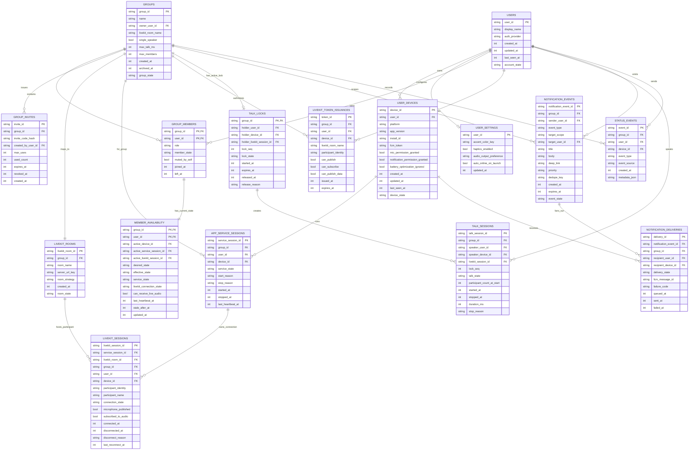

# Flutter + LiveKit Walkie-Talkie ERD

## Scope

This document finalizes the data model for an Android-first Flutter walkie-talkie app using LiveKit for realtime audio.

The app is for a very small private group. The first screen should stay minimal:

- Go online / go away.
- Hold a mic button to talk.
- Show each friend's current availability.
- Notify friends when a member becomes live.
- Let users send manual nudge notifications to friends.
- Let each user choose a vibrant app accent color from settings.

## Key Product Contract

The user-facing requirement is:

> If a user marked themselves online before closing the app, incoming voice should still play on that device.

The technically accurate contract for Android is:

- This is supported when the app starts and keeps an Android foreground service running.
- The device must remain connected to the LiveKit room while the UI is closed or backgrounded.
- A persistent Android notification is required while the user is online.
- If the user force-stops the app, removes required permissions, disables notifications/service behavior, the OS kills the service, or the device goes offline, live audio cannot be guaranteed.
- FCM cannot reliably recover live audio after force-stop. Firebase documents force-stopped apps as a case where messages are dropped.

Therefore the data model separates:

- `desired_state`: what the user selected, such as `online` or `away`.
- `effective_state`: what the system can currently prove, such as `live`, `talking`, `listening`, `stale`, or `offline`.

The UI should show `live` only when the foreground service, heartbeat, and LiveKit connection are healthy.

## Research Notes

- LiveKit Flutter SDK is installed with `flutter pub add livekit_client` and connects to a room using a LiveKit URL and token.
- LiveKit requires server-generated access tokens. The client must not contain the LiveKit API secret.
- LiveKit self-hosting supports realtime media and data; self-hosting gives control over infrastructure and cost.
- LiveKit VM deployment uses Docker Compose and Caddy, and can support TURN/TLS.
- Android 14+ requires foreground service types and permissions for microphone/background media use.
- Android restricts starting microphone foreground services from the background.
- FCM messages can be dropped when the app is force-stopped.
- Firebase Cloud Messaging has no direct usage cost, but notification delivery still depends on device state, notification permission, and OS/FCM policy.

Reference links:

- LiveKit Flutter SDK: https://docs.livekit.io/transport/sdk-platforms/flutter/
- LiveKit tokens and grants: https://docs.livekit.io/frontends/reference/tokens-grants/
- LiveKit self-hosting: https://docs.livekit.io/transport/self-hosting/
- LiveKit VM deployment: https://docs.livekit.io/transport/self-hosting/vm/
- Android foreground service types: https://developer.android.com/develop/background-work/services/fgs/service-types
- Android foreground service background-start restrictions: https://developer.android.com/develop/background-work/services/fgs/restrictions-bg-start
- Firebase Cloud Messaging: https://firebase.google.com/products/cloud-messaging
- Firebase Admin SDK send docs: https://firebase.google.com/docs/cloud-messaging/send/admin-sdk
- Firebase Android message priority: https://firebase.google.com/docs/cloud-messaging/android-message-priority
- FCM delivery behavior: https://firebase.blog/posts/2024/07/understand-fcm-delivery-rates/

## Assumptions

- Platform target is Android first.
- Flutter is the app framework.
- LiveKit carries live audio.
- Firebase Auth identifies users.
- Firebase Realtime Database stores group membership, settings, availability, talk locks, and lightweight event history.
- Audio is live-only in MVP. No voice messages or recordings are stored.
- One speaker at a time in MVP.
- One active private group in MVP, but the model allows more groups later.
- A user can have more than one device, but only one active device per group should be considered receivable at a time.
- Accent colors are app-defined keys, not arbitrary user-entered color values.
- "Friend went live" and "nudge" notifications are server-sent through Firebase Admin SDK, not directly from the client.
- Notification events are stored for audit/debugging; they are not a source of guaranteed delivery.

## Entity Relationship Diagram



## Entity Definitions

### `USERS`

Stores the human identity. The primary key should match the Firebase Auth UID.

Important fields:

- `display_name`: shown on the group screen.
- `account_state`: `active`, `disabled`, or `deleted`.
- `last_seen_at`: updated from app activity, not a guarantee of receivability.

### `USER_DEVICES`

Stores one row per app install/device.

Important fields:

- `fcm_token`: used for non-live nudges and service warnings.
- `mic_permission_granted`: used to decide if the user can go live.
- `notification_permission_granted`: required for foreground-service notification visibility.
- `battery_optimization_ignored`: useful diagnostic flag. Not required, but strongly recommended for reliability.
- `device_state`: `active`, `revoked`, or `stale`.

### `USER_SETTINGS`

Stores user-visible settings.

Important fields:

- `accent_color_key`: app-defined palette key, for example `coral`, `lime`, `blue`, `violet`, `amber`, or `pink`.
- `audio_output_preference`: `speaker`, `earpiece`, `bluetooth`, or `system`.
- `auto_online_on_launch`: optional; defaults to `false` for MVP.

No backend table is needed for color options unless colors must be remotely configurable. For MVP, color keys can be app constants.

### `GROUPS`

Stores the private friend group.

Important fields:

- `livekit_room_name`: stable LiveKit room name for the group.
- `single_speaker`: `true` for MVP.
- `max_talk_ms`: hard cap to release stale talk locks.
- `max_members`: `4` for the initial friend-group scope.

### `GROUP_MEMBERS`

Join table between users and groups.

Important fields:

- `role`: `owner` or `member`.
- `member_state`: `active`, `left`, `removed`, or `blocked`.
- `muted_by_self`: user-level listen preference for the group.

### `GROUP_INVITES`

Stores private invite codes.

Important fields:

- `invite_code_hash`: store a hash, not the raw invite code.
- `max_uses`: `3` for a four-person group after owner creation, or `null` if manually controlled.
- `expires_at` and `revoked_at`: allow safe invite cleanup.

### `LIVEKIT_ROOMS`

Maps an app group to a LiveKit room.

Important fields:

- `room_name`: the name passed into LiveKit token grants.
- `server_url_key`: reference to environment config, not the actual secret.
- `room_strategy`: `persistent_group_room` for MVP.

LiveKit itself owns the actual media room lifecycle. This entity is our app-side mapping.

### `MEMBER_AVAILABILITY`

Current user state per group. This is the most important entity for the first screen.

Important fields:

- `desired_state`: user-set value: `online` or `away`.
- `effective_state`: system-proven value: `away`, `connecting`, `live`, `talking`, `listening`, `stale`, `offline`, or `error`.
- `service_state`: `stopped`, `starting`, `running`, `stopping`, `crashed`, or `unknown`.
- `livekit_connection_state`: `disconnected`, `connecting`, `connected`, `reconnecting`, or `failed`.
- `can_receive_live_audio`: true only when the service is running, LiveKit is connected, audio subscription is active, and heartbeat is fresh.
- `last_heartbeat_at`: maintained by the foreground service.
- `stale_after_at`: timestamp after which the user should no longer be shown as live.

Rule:

```txt
can_receive_live_audio =
  desired_state == online
  and service_state == running
  and livekit_connection_state == connected
  and last_heartbeat_at < stale_after_at
```

If `desired_state == online` but heartbeat is stale, the UI must show `stale` or `offline`, not `live`.

### `APP_SERVICE_SESSIONS`

Tracks Android foreground-service runs.

Important fields:

- `start_reason`: `user_online`, `app_launch_restore`, `notification_action`, or `reconnect`.
- `stop_reason`: `user_away`, `logout`, `permission_revoked`, `network_lost`, `crash`, `force_stop_detected`, or `unknown`.
- `last_heartbeat_at`: service-level heartbeat.

This entity is required because "app closed but still online" depends on the service, not the Flutter UI.

### `LIVEKIT_SESSIONS`

Tracks app connection to the LiveKit room.

Important fields:

- `participant_identity`: should be deterministic, for example `{groupId}:{userId}:{deviceId}`.
- `microphone_published`: true while the user is publishing microphone audio.
- `subscribed_to_audio`: true while subscribed to remote audio tracks.
- `connection_state`: LiveKit connection state.
- `disconnect_reason`: useful for debugging background behavior.

### `LIVEKIT_TOKEN_ISSUANCES`

Audit record for token generation.

Important fields:

- `participant_identity`: must match the LiveKit session identity.
- `can_publish`: true for group members unless temporarily restricted.
- `can_subscribe`: true for group members.
- `expires_at`: token TTL should be short enough to limit stale access.

Do not store the token itself unless there is a specific debug need. Never store the LiveKit API secret in the client database.

### `TALK_LOCKS`

Current one-speaker-at-a-time lock.

Important fields:

- `group_id`: primary key. One active talk lock per group.
- `holder_user_id`: current speaker.
- `holder_livekit_session_id`: active LiveKit session that owns the mic.
- `lock_seq`: monotonically increasing sequence for race safety.
- `expires_at`: hard timeout to prevent stuck mic locks.

Only the holder should be allowed to publish microphone audio. Other clients remain subscribed/listening.

### `TALK_SESSIONS`

History of talk attempts that successfully acquired the lock.

Important fields:

- `talk_state`: `started`, `completed`, `expired`, or `failed`.
- `participant_count_at_start`: number of members with `can_receive_live_audio == true` at start time.
- `duration_ms`: useful for debugging and quotas.

No audio payload is stored.

### `NOTIFICATION_EVENTS`

Stores server-created push notification intents.

Important fields:

- `event_type`: `friend_live` or `nudge`.
- `target_scope`: `all_friends`, `online_friends`, `away_friends`, or `single_friend`.
- `target_user_id`: required only when `target_scope=single_friend`.
- `deep_link`: app route to open when the notification is tapped, for example `walkie://group/{groupId}`.
- `priority`: `high` for time-sensitive visible nudges/live alerts.
- `dedupe_key`: prevents duplicate "went live" notifications during reconnect loops.
- `event_state`: `queued`, `sent`, `partial_failure`, `failed`, `skipped`, or `expired`.

Rules:

- `friend_live` is created only after the sender reaches `effective_state=live`.
- `friend_live` targets active group members except the sender.
- `nudge` can target one friend or all friends depending on UI.
- Clients do not call FCM directly. The backend creates the event and sends FCM through Firebase Admin SDK.

### `NOTIFICATION_DELIVERIES`

Stores one row per attempted recipient device.

Important fields:

- `recipient_user_id`: friend who should receive the notification.
- `recipient_device_id`: target device.
- `delivery_state`: `queued`, `sent`, `failed`, or `skipped`.
- `fcm_message_id`: returned by FCM when accepted for delivery.
- `failure_code`: invalid token, notifications disabled, missing token, not group member, rate limited, or FCM failure.

This entity tracks send attempts, not proof that the user saw the notification.

### `STATUS_EVENTS`

Lightweight event stream for diagnostics and UI history.

Useful event types:

- `user_online_requested`
- `user_away_requested`
- `service_started`
- `service_stopped`
- `livekit_connected`
- `livekit_reconnecting`
- `livekit_disconnected`
- `talk_started`
- `talk_stopped`
- `talk_denied_busy`
- `availability_stale`
- `permission_missing`
- `friend_live_notification_sent`
- `nudge_sent`
- `nudge_rate_limited`
- `notification_delivery_failed`

This should be bounded by retention rules because it is diagnostic, not core product state.

## State Model

### User-Set Availability

```txt
away
  User does not want to receive live audio.

online
  User wants to receive live audio, and the app should keep the foreground service and LiveKit connection alive.
```

### Effective Availability

```txt
away
  desired_state is away.

connecting
  desired_state is online, but service or LiveKit connection is not ready yet.

live
  desired_state is online, foreground service is running, LiveKit is connected, and heartbeat is fresh.

talking
  user owns the current talk lock and microphone is publishing.

listening
  another user owns the talk lock and this user is connected/subscribed.

stale
  desired_state is online, but heartbeat expired.

offline
  service is stopped or no active connection exists.

error
  permission, token, or connection failure blocks live receive.
```

### App Condition Matrix

| Device/app condition | Should receive live audio? | Data state |
| --- | --- | --- |
| App open, user online, LiveKit connected | Yes | `effective_state=live` |
| App backgrounded, foreground service running, LiveKit connected | Yes | `effective_state=live` |
| UI closed/swiped but foreground service still running | Expected yes, device/OEM dependent | `effective_state=live` while heartbeat fresh |
| User manually taps away | No | `desired_state=away`, `effective_state=away` |
| App force-stopped from system settings | No reliable receive | heartbeat expires, `effective_state=stale/offline` |
| OS/battery manager kills service | No reliable receive | heartbeat expires, `effective_state=stale/offline` |
| Device offline | No | `effective_state=stale/offline` |
| Mic permission revoked | Cannot talk; may still listen if service connected | `effective_state=error` if receive is blocked |
| Notification permission/service blocked | Online mode should be blocked or degraded | `effective_state=error` |

## Notification Model

### Friend Went Live Notification

Trigger:

```txt
memberAvailability/{groupId}/{senderUserId}.effectiveState transitions to live
and canReceiveLiveAudio == true
and this is not a reconnect duplicate inside the dedupe window
```

Recipients:

```txt
All active group members except sender.
```

Payload intent:

```txt
title: "{displayName} is live"
body: "Tap to open the walkie-talkie"
deep_link: "walkie://group/{groupId}"
priority: high
event_type: friend_live
```

Important rule:

```txt
Send after effective live state, not immediately after desired_state=online.
```

Reason:

```txt
Friends should be notified only when the sender is actually reachable through the LiveKit room.
```

### Manual Nudge Notification

Trigger:

```txt
User taps Nudge for one friend or all friends.
```

Recipients:

```txt
Single selected active group member, or all active group members except sender.
```

Payload intent:

```txt
title: "{displayName} nudged you"
body: "Come online on walkie-talkie"
deep_link: "walkie://group/{groupId}"
priority: high
event_type: nudge
```

Nudges should be rate-limited per sender and recipient to prevent spam.

Recommended MVP rate limit:

```txt
Max 1 nudge from same sender to same recipient every 60 seconds.
Max 5 nudges from same sender per group every 10 minutes.
```

### Notification Delivery Limits

The backend can guarantee only:

```txt
The notification event was accepted for processing.
The backend attempted FCM delivery to known recipient device tokens.
FCM accepted or rejected each target token.
```

The backend cannot guarantee:

```txt
The device displayed the notification.
The user saw the notification.
The notification was delivered to a force-stopped app.
The notification was shown when the user denied notification permission.
```

## Suggested Firebase Realtime Database Shape

This is the physical shape for the logical ERD above.

```json
{
  "users": {
    "{userId}": {
      "displayName": "Aman",
      "authProvider": "anonymous",
      "accountState": "active",
      "createdAt": 1720000000,
      "updatedAt": 1720000000,
      "lastSeenAt": 1720000000
    }
  },
  "userDevices": {
    "{userId}": {
      "{deviceId}": {
        "platform": "android",
        "appVersion": "1.0.0",
        "installId": "...",
        "fcmToken": "...",
        "micPermissionGranted": true,
        "notificationPermissionGranted": true,
        "batteryOptimizationIgnored": false,
        "deviceState": "active",
        "createdAt": 1720000000,
        "updatedAt": 1720000000,
        "lastSeenAt": 1720000000
      }
    }
  },
  "userSettings": {
    "{userId}": {
      "accentColorKey": "coral",
      "hapticsEnabled": true,
      "audioOutputPreference": "speaker",
      "autoOnlineOnLaunch": false,
      "updatedAt": 1720000000
    }
  },
  "groups": {
    "{groupId}": {
      "name": "Friends",
      "ownerUserId": "{userId}",
      "livekitRoomName": "group_{groupId}",
      "singleSpeaker": true,
      "maxTalkMs": 60000,
      "maxMembers": 4,
      "groupState": "active",
      "createdAt": 1720000000,
      "archivedAt": null
    }
  },
  "groupMembers": {
    "{groupId}": {
      "{userId}": {
        "role": "owner",
        "memberState": "active",
        "mutedBySelf": false,
        "joinedAt": 1720000000,
        "leftAt": null
      }
    }
  },
  "groupInvites": {
    "{inviteId}": {
      "groupId": "{groupId}",
      "inviteCodeHash": "...",
      "createdByUserId": "{userId}",
      "maxUses": 3,
      "usedCount": 0,
      "expiresAt": 1720000000,
      "revokedAt": null,
      "createdAt": 1720000000
    }
  },
  "livekitRooms": {
    "{groupId}": {
      "livekitRoomId": "{groupId}",
      "roomName": "group_{groupId}",
      "serverUrlKey": "primary",
      "roomStrategy": "persistent_group_room",
      "roomState": "active",
      "createdAt": 1720000000
    }
  },
  "memberAvailability": {
    "{groupId}": {
      "{userId}": {
        "activeDeviceId": "{deviceId}",
        "activeServiceSessionId": "{serviceSessionId}",
        "activeLivekitSessionId": "{livekitSessionId}",
        "desiredState": "online",
        "effectiveState": "live",
        "serviceState": "running",
        "livekitConnectionState": "connected",
        "canReceiveLiveAudio": true,
        "lastHeartbeatAt": 1720000000,
        "staleAfterAt": 1720000030,
        "updatedAt": 1720000000
      }
    }
  },
  "appServiceSessions": {
    "{serviceSessionId}": {
      "groupId": "{groupId}",
      "userId": "{userId}",
      "deviceId": "{deviceId}",
      "serviceState": "running",
      "startReason": "user_online",
      "stopReason": null,
      "startedAt": 1720000000,
      "stoppedAt": null,
      "lastHeartbeatAt": 1720000000
    }
  },
  "livekitSessions": {
    "{livekitSessionId}": {
      "serviceSessionId": "{serviceSessionId}",
      "livekitRoomId": "{groupId}",
      "groupId": "{groupId}",
      "userId": "{userId}",
      "deviceId": "{deviceId}",
      "participantIdentity": "{groupId}:{userId}:{deviceId}",
      "participantName": "Aman",
      "connectionState": "connected",
      "microphonePublished": false,
      "subscribedToAudio": true,
      "connectedAt": 1720000000,
      "disconnectedAt": null,
      "disconnectReason": null,
      "lastReconnectAt": null
    }
  },
  "livekitTokenIssuances": {
    "{tokenId}": {
      "groupId": "{groupId}",
      "userId": "{userId}",
      "deviceId": "{deviceId}",
      "livekitRoomName": "group_{groupId}",
      "participantIdentity": "{groupId}:{userId}:{deviceId}",
      "canPublish": true,
      "canSubscribe": true,
      "canPublishData": true,
      "issuedAt": 1720000000,
      "expiresAt": 1720003600
    }
  },
  "talkLocks": {
    "{groupId}": {
      "holderUserId": "{userId}",
      "holderDeviceId": "{deviceId}",
      "holderLivekitSessionId": "{livekitSessionId}",
      "lockSeq": 42,
      "lockState": "acquired",
      "startedAt": 1720000000,
      "expiresAt": 1720000060,
      "releasedAt": null,
      "releaseReason": null
    }
  },
  "talkSessions": {
    "{groupId}": {
      "{talkSessionId}": {
        "speakerUserId": "{userId}",
        "speakerDeviceId": "{deviceId}",
        "livekitSessionId": "{livekitSessionId}",
        "lockSeq": 42,
        "talkState": "started",
        "participantCountAtStart": 4,
        "startedAt": 1720000000,
        "stoppedAt": null,
        "durationMs": null,
        "stopReason": null
      }
    }
  },
  "notificationEvents": {
    "{groupId}": {
      "{notificationEventId}": {
        "senderUserId": "{userId}",
        "eventType": "friend_live",
        "targetScope": "all_friends",
        "targetUserId": null,
        "title": "Aman is live",
        "body": "Tap to open the walkie-talkie",
        "deepLink": "walkie://group/{groupId}",
        "priority": "high",
        "dedupeKey": "friend_live:{groupId}:{userId}:1720000000",
        "eventState": "sent",
        "createdAt": 1720000000,
        "expiresAt": 1720000300
      }
    }
  },
  "notificationDeliveries": {
    "{notificationEventId}": {
      "{deliveryId}": {
        "groupId": "{groupId}",
        "recipientUserId": "{friendUserId}",
        "recipientDeviceId": "{deviceId}",
        "deliveryState": "sent",
        "fcmMessageId": "projects/.../messages/...",
        "failureCode": null,
        "queuedAt": 1720000000,
        "sentAt": 1720000001,
        "failedAt": null
      }
    }
  },
  "statusEvents": {
    "{groupId}": {
      "{eventId}": {
        "userId": "{userId}",
        "deviceId": "{deviceId}",
        "eventType": "livekit_connected",
        "eventSource": "foreground_service",
        "createdAt": 1720000000,
        "metadataJson": "{}"
      }
    }
  }
}
```

## Invariants

- A group has exactly one `LIVEKIT_ROOMS` mapping.
- A group has at most one active `TALK_LOCKS` row.
- A user can be an active member of a group only once.
- A group can have at most `max_members` active members.
- A group member has exactly one current `MEMBER_AVAILABILITY` row.
- `effective_state=live` requires `can_receive_live_audio=true`.
- `can_receive_live_audio=true` requires a fresh heartbeat, running service, and connected LiveKit session.
- `talking` requires the user to hold the current talk lock.
- `listening` requires another user to hold the talk lock and this user to be subscribed to audio.
- `friend_live` notifications are sent only after `effective_state=live`.
- Notification sends must go through the backend, not directly from the Flutter client.
- Notification delivery rows represent FCM send attempts, not guaranteed user visibility.
- Raw audio is never stored in Firebase.
- LiveKit tokens are generated server-side and should not be persisted as plaintext in client-readable DB paths.

## UI State Mapping

The first screen can be driven from these fields:

```txt
Current user:
  memberAvailability/{groupId}/{userId}.desiredState
  memberAvailability/{groupId}/{userId}.effectiveState
  talkLocks/{groupId}
  userSettings/{userId}.accentColorKey

Friend list:
  groupMembers/{groupId}
  users/{friendUserId}.displayName
  memberAvailability/{groupId}/{friendUserId}.effectiveState

Nudge button enabled:
  current user is active group member
  target user is active group member
  target user != current user
  rate limit not exceeded

Mic button enabled:
  desiredState == online
  effectiveState in [live, listening]
  no active talk lock OR active talk lock held by current user
  micPermissionGranted == true

Incoming audio expected:
  desiredState == online
  canReceiveLiveAudio == true
```

Recommended visible labels:

- `Away`: user intentionally unavailable.
- `Connecting`: trying to become live.
- `Live`: user should hear incoming voice.
- `Talking`: user is currently speaking.
- `Listening`: user is receiving someone else's talk session.
- `Offline`: not reachable.
- `Needs setup`: permissions/service settings missing.

## ERD Decisions

- LiveKit replaces custom WebRTC signaling tables. No `signals`, `offers`, `answers`, or ICE candidate entities are needed.
- The talk lock remains in Firebase because the product requires push-to-talk control and one speaker at a time.
- Availability is app-owned, not LiveKit-owned, because it must represent Android service health, user intent, and UI status.
- The model intentionally distinguishes `desired_state=online` from `effective_state=live`.
- Accent colors belong in `USER_SETTINGS`; no separate color table is needed for MVP.
- Friend-live and nudge notifications are modeled as `NOTIFICATION_EVENTS` plus `NOTIFICATION_DELIVERIES`.
- Notification events are created by the backend because FCM requires trusted server credentials.
- Talk history stores metadata only, never audio.

## Non-Blocking Follow-Up Decisions

These should be finalized before the implementation plan, but they do not change the core ERD:

- Exact heartbeat interval and stale timeout. Initial recommendation: heartbeat every 10 seconds, stale after 30 seconds.
- Whether to block online mode unless battery optimization is disabled, or only warn the user.
- Whether `auto_online_on_launch` should exist in MVP or be hidden until later.
- Whether the app allows multiple groups in UI, even though the ERD supports it.
- Exact accent color keys and palette values.
- Exact notification copy for friend-live and nudge notifications.
- Whether the nudge UI targets one friend at a time or supports "nudge all" in MVP.
