# Flutter + LiveKit Walkie-Talkie Technical Plan

## Status

This plan supersedes the older raw WebRTC approach for the Flutter implementation.

Related docs:

- ERD: `requirements/flutter-livekit-erd.md`
- Older raw WebRTC plan: `requirements/android-walkie-talkie-tech-plan.md`

## Problem Statement

Build a private Android-first walkie-talkie app for a small friend group.

The app should let a user:

- Go online or away from a minimal first screen.
- Hold a mic button to speak.
- Hear a friend's live voice immediately when that friend is speaking.
- See whether each friend is away, connecting, live, talking, listening, offline, or needs setup.
- Notify friends as soon as the user becomes live.
- Send manual nudge notifications to friends to ask them to come online.
- Pick a vibrant accent color from app settings.

The critical expectation is:

> If a user marks themselves online before closing the UI, incoming voice should still play.

The technical contract is:

- Supported when the Android foreground service is still running and connected to LiveKit.
- Supported when the app is backgrounded or the screen is locked.
- Target-supported when the UI is swiped away but the foreground service remains alive.
- Not guaranteed if the user force-stops the app, the OS kills the foreground service, permissions are revoked, battery restrictions block the service, or the device goes offline.

## Overall General Solution

Use Flutter for the app UI and business logic, LiveKit for realtime audio rooms, Firebase for identity and shared app state, and a small backend for secure LiveKit token generation.

High-level design:

```txt
Flutter Android app
  -> Firebase Auth for identity
  -> Firebase Realtime Database for groups, availability, talk locks, settings
  -> Token backend for LiveKit access tokens
  -> Firebase Cloud Messaging for live/nudge notifications
  -> Self-hosted LiveKit for realtime audio
  -> Android foreground service for online receive mode
```

LiveKit replaces custom WebRTC signaling. The app no longer stores SDP offers, answers, or ICE candidates.

Firebase remains the source of truth for:

- Users
- Devices
- Groups
- Group members
- Availability
- Talk locks
- Settings
- Notification events
- Notification delivery attempts
- Lightweight status/talk events

LiveKit is the source of truth for:

- Realtime media transport
- Room connection state
- Published microphone tracks
- Remote audio subscriptions

The app bridges both worlds by writing LiveKit connection state into Firebase availability paths.

## Exact Services

### Required

```txt
Mobile app:
Flutter Android app

Realtime audio:
LiveKit self-hosted server

Auth:
Firebase Authentication

Database:
Firebase Realtime Database

Token backend:
Node.js service with LiveKit server SDK and Firebase Admin SDK

Push notifications:
Firebase Cloud Messaging through Firebase Admin SDK

Hosting:
Oracle Cloud Always Free VM

Reverse proxy/TLS:
Caddy with Let's Encrypt

Process management:
Docker Compose on VM
```

### Recommended

```txt
Crash/error visibility:
Firebase Crashlytics

Monitoring:
Basic VM logs, Docker logs, LiveKit logs

Domain:
One owned domain or subdomain for LiveKit and token backend
```

### Optional Later

```txt
Analytics:
Firebase Analytics

Recording:
Not in MVP

Voice replay/history:
Not in MVP

Multi-group UI:
Supported by ERD, hidden in MVP
```

## Tech Stack

### Flutter App

```yaml
runtime:
  flutter: stable channel
  dart: stable
  platform_target: android

core_packages:
  livekit_client: LiveKit Flutter SDK
  firebase_core: Firebase initialization
  firebase_auth: Firebase Auth
  firebase_database: Firebase Realtime Database
  firebase_messaging: FCM token and optional notifications
  firebase_crashlytics: crash reporting
  flutter_foreground_task: Android foreground service wrapper
  permission_handler: runtime permission prompts
  device_info_plus: device metadata
  package_info_plus: app version metadata
  uuid: generated IDs
  flutter_riverpod: app state management
  go_router: navigation
```

### Backend

```yaml
runtime:
  node: 22 LTS or current LTS available on the VM
  language: TypeScript

packages:
  express: HTTP API
  livekit-server-sdk: LiveKit token generation
  firebase-admin: verify Firebase ID tokens and read membership
  zod: request validation
  pino: structured logging
  helmet: basic HTTP hardening
```

### Infrastructure

```yaml
vm:
  provider: Oracle Cloud Always Free
  os: Ubuntu LTS

containers:
  livekit-server
  redis
  token-api
  caddy

network:
  80/tcp: TLS issuance
  443/tcp: HTTPS, token API, LiveKit WebSocket, TURN/TLS
  7881/tcp: LiveKit WebRTC over TCP
  3478/udp: TURN/UDP
  50000-60000/udp: LiveKit WebRTC UDP media
```

## Architecture

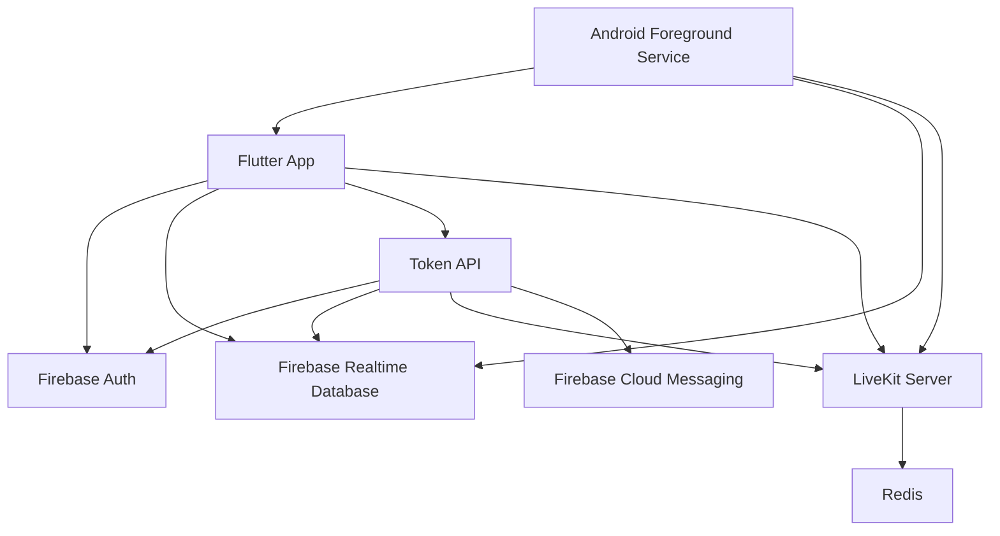

Responsibilities:

```txt
Flutter UI:
  Minimal home screen, mic button, friend list, settings.

Foreground service:
  Keeps online receive mode visible to Android.
  Keeps heartbeat fresh.
  Keeps or supervises the LiveKit room connection.

Firebase:
  Stores app state and synchronizes group/talk state.

Token API:
  Verifies Firebase identity and group membership.
  Issues LiveKit room tokens.
  Sends friend-live and nudge notifications through FCM.
  Stores notification events and delivery attempts.

LiveKit:
  Carries realtime microphone audio.
  Handles room membership, media transport, reconnects, TURN/TLS.
```

## Key Implementation Decision

When a user goes online, the app should connect to the LiveKit room immediately and stay connected until the user goes away.

This is required because the receiving phone cannot wait until a talk event to connect. A cold connect would add delay and may fail when the UI is closed.

Online mode means:

```txt
desired_state = online
foreground service = running
LiveKit room = connected
subscribed_to_audio = true
mic = disabled unless user is actively pressing talk
heartbeat = fresh
```

As soon as online mode becomes effective live, the app/service must ask the backend to send a `friend_live` notification to friends.

Important:

```txt
Send friend-live notification after effective_state=live, not merely after desired_state=online.
```

Reason:

```txt
The notification should mean "this friend is actually reachable now".
```

Away mode means:

```txt
desired_state = away
foreground service = stopped
LiveKit room = disconnected
subscribed_to_audio = false
mic = disabled
heartbeat = stopped
```

## Android Background Strategy

### Target Behavior

The app must receive audio in these conditions:

```txt
App foreground: yes
App backgrounded: yes
Screen locked: yes
UI swiped away while foreground service survives: target yes
App force-stopped: no, impossible to guarantee
OS kills service: no, recover only when app/service restarts
```

### Foreground Service Model

When the user taps `Online`:

1. Request required permissions.
2. Start Android foreground service from visible UI.
3. Show persistent notification: `Online - listening for friends`.
4. Connect to LiveKit.
5. Write `desired_state=online`.
6. Write `effective_state=live` only after LiveKit is connected and heartbeat is fresh.

When the user taps `Away`:

1. Disable microphone.
2. Release any held talk lock.
3. Disconnect LiveKit.
4. Stop heartbeat.
5. Write `desired_state=away`.
6. Write `effective_state=away`.
7. Stop foreground service.

### Android Permissions

Manifest-level requirements:

```xml
<uses-permission android:name="android.permission.INTERNET" />
<uses-permission android:name="android.permission.ACCESS_NETWORK_STATE" />
<uses-permission android:name="android.permission.RECORD_AUDIO" />
<uses-permission android:name="android.permission.MODIFY_AUDIO_SETTINGS" />
<uses-permission android:name="android.permission.FOREGROUND_SERVICE" />
<uses-permission android:name="android.permission.FOREGROUND_SERVICE_MICROPHONE" />
<uses-permission android:name="android.permission.FOREGROUND_SERVICE_MEDIA_PLAYBACK" />
<uses-permission android:name="android.permission.POST_NOTIFICATIONS" />
```

Service declaration should use foreground service types for microphone and media playback.

Notification channels:

```txt
walkie_service:
  Persistent foreground-service notification while online.

walkie_alerts:
  Friend-live and nudge notifications.
```

Important Android rule:

- Start the foreground service while the app has a visible activity.
- Do not rely on starting a microphone foreground service after the app is already fully backgrounded.

### Background Reliability Spike

Before building the full app, run a small proof-of-concept with:

- Flutter app
- `livekit_client`
- `flutter_foreground_task`
- one LiveKit room
- two Android devices
- one device speaking
- one device receiving while foregrounded, backgrounded, locked, and swiped from recents

Acceptance for the spike:

```txt
Receiver hears audio while app is foregrounded.
Receiver hears audio while app is backgrounded.
Receiver hears audio while screen is locked.
Receiver heartbeat remains fresh while UI is closed but service notification is active.
Receiver becomes stale/offline within 30 seconds if service dies.
Force-stop is correctly documented as not supported.
```

If `livekit_client` cannot run reliably from the Flutter foreground-service setup, fallback is a minimal Android service bridge that owns the LiveKit connection. The product remains Flutter-first, but this fallback would add small native Android glue for the service lifecycle.

## Data Design

Use the ERD from:

```txt
requirements/flutter-livekit-erd.md
```

Primary Firebase paths:

```txt
/users/{userId}
/userDevices/{userId}/{deviceId}
/userSettings/{userId}
/groups/{groupId}
/groupMembers/{groupId}/{userId}
/groupInvites/{inviteId}
/livekitRooms/{groupId}
/memberAvailability/{groupId}/{userId}
/appServiceSessions/{serviceSessionId}
/livekitSessions/{livekitSessionId}
/livekitTokenIssuances/{tokenId}
/talkLocks/{groupId}
/talkSessions/{groupId}/{talkSessionId}
/notificationEvents/{groupId}/{notificationEventId}
/notificationDeliveries/{notificationEventId}/{deliveryId}
/statusEvents/{groupId}/{eventId}
```

The app should not write raw audio to Firebase.

## User Flows One Liners

- First launch: sign in anonymously, create user profile, register device.
- Set name: user enters display name, stored in `/users/{userId}`.
- Create group: owner creates group and LiveKit room mapping.
- Invite friends: owner creates invite code, shares it out of band.
- Join group: friend enters code and becomes an active group member.
- Go online: app starts foreground service, connects LiveKit, writes live availability.
- Friend-live notification: after user reaches live state, backend sends FCM notification to active friends.
- Go away: app disconnects LiveKit, stops service, writes away availability.
- Press mic: app acquires talk lock, enables microphone, LiveKit publishes audio.
- Release mic: app disables microphone, releases talk lock.
- Busy press: app rejects mic press if another member holds the lock.
- Nudge friend: user taps nudge, backend sends FCM notification to selected friend or friends.
- Background receive: foreground service keeps LiveKit connected while UI is closed.
- Stale detection: heartbeat expiry changes live user to stale/offline.
- Settings: user picks accent color, app updates local theme and `/userSettings/{userId}`.

## App Screens

### Home Screen

Minimal first screen:

```txt
Top:
  User avatar/name
  Current state: Away, Connecting, Live, Talking, Listening, Offline, Needs setup

Center:
  Large hold-to-talk mic button

Bottom:
  Friend availability row/list
  Nudge action on friend rows
  Online/Away control
  Settings button
```

Home screen rules:

- The mic button is large and primary.
- The online/away control is obvious and not buried.
- Friend status is visible without navigating.
- Nudge is available from each friend row.
- No feed, no timeline, no audio history in MVP.

### Settings Screen

Settings:

```txt
Display name
Accent color selector
Haptics toggle
Audio output preference
Background reliability checklist
Go away on logout
```

Accent colors should be vibrant app-defined options:

```txt
coral
lime
sky
violet
amber
pink
teal
```

Do not allow arbitrary hex input in MVP. It creates avoidable contrast and accessibility work.

### Setup Checklist

Shown only when requirements are missing:

```txt
Microphone permission
Notification permission
Foreground service notification active
Battery optimization warning
Network reachable
LiveKit reachable
```

## Backend API Contracts

All backend requests use Firebase Auth ID token:

```http
Authorization: Bearer <firebase_id_token>
Content-Type: application/json
```

### `GET /healthz`

Purpose: VM/API health check.

Response:

```json
{
  "ok": true,
  "service": "walkie-token-api",
  "time": 1720000000
}
```

### `POST /v1/livekit/token`

Purpose: issue LiveKit token for a group room.

Request:

```json
{
  "groupId": "group_123",
  "deviceId": "device_abc",
  "serviceSessionId": "svc_123",
  "livekitSessionId": "lk_123"
}
```

Backend validation:

```txt
Verify Firebase ID token.
Verify user is active group member.
Verify group is active.
Verify device belongs to user.
Read /livekitRooms/{groupId}.
Generate participantIdentity = {groupId}:{userId}:{deviceId}.
Issue token with roomJoin, canPublish, canSubscribe, canPublishData.
Write /livekitTokenIssuances/{tokenId}.
```

Response:

```json
{
  "serverUrl": "wss://livekit.example.com",
  "roomName": "group_group_123",
  "participantIdentity": "group_123:user_123:device_abc",
  "participantName": "Aman",
  "token": "jwt...",
  "expiresAt": 1720003600
}
```

### `POST /v1/groups/{groupId}/notifications/friend-live`

Purpose: send notification to friends when the current user becomes live.

Caller:

```txt
Foreground service immediately after LiveKit connected and /memberAvailability shows canReceiveLiveAudio=true.
```

Request:

```json
{
  "deviceId": "device_abc",
  "serviceSessionId": "svc_123",
  "livekitSessionId": "lk_123"
}
```

Backend validation:

```txt
Verify Firebase ID token.
Verify sender is active group member.
Verify sender device belongs to sender.
Read /memberAvailability/{groupId}/{senderUserId}.
Require desiredState=online.
Require effectiveState=live.
Require canReceiveLiveAudio=true.
Dedupe repeated calls for the same sender/group inside a short window.
Collect active group members excluding sender.
Collect valid FCM tokens for recipient devices.
Create /notificationEvents/{groupId}/{notificationEventId}.
Send high-priority visible FCM notification using Firebase Admin SDK.
Create /notificationDeliveries/{notificationEventId}/{deliveryId} rows.
Write status event friend_live_notification_sent or notification_delivery_failed.
```

Response:

```json
{
  "notificationEventId": "notif_123",
  "eventType": "friend_live",
  "deduped": false,
  "recipientUsers": 3,
  "targetDevices": 3,
  "sent": 3,
  "failed": 0,
  "skipped": 0
}
```

FCM payload intent:

```json
{
  "notification": {
    "title": "Aman is live",
    "body": "Tap to open the walkie-talkie"
  },
  "data": {
    "type": "friend_live",
    "groupId": "group_123",
    "senderUserId": "user_123",
    "deepLink": "walkie://group/group_123"
  },
  "android": {
    "priority": "high",
    "notification": {
      "channelId": "walkie_alerts",
      "clickAction": "OPEN_WALKIE_GROUP"
    }
  }
}
```

### `POST /v1/groups/{groupId}/nudges`

Purpose: send a manual nudge notification to one friend or all friends.

Request for one friend:

```json
{
  "targetScope": "single_friend",
  "targetUserId": "friend_user_123"
}
```

Request for all friends:

```json
{
  "targetScope": "all_friends"
}
```

Backend validation:

```txt
Verify Firebase ID token.
Verify sender is active group member.
Verify target user is active group member when targetScope=single_friend.
Exclude sender from recipients.
Apply nudge rate limits.
Collect valid FCM tokens for recipient devices.
Create /notificationEvents/{groupId}/{notificationEventId}.
Send high-priority visible FCM notification using Firebase Admin SDK.
Create /notificationDeliveries/{notificationEventId}/{deliveryId} rows.
Write status event nudge_sent, nudge_rate_limited, or notification_delivery_failed.
```

Recommended MVP rate limits:

```txt
Max 1 nudge from same sender to same recipient every 60 seconds.
Max 5 nudges from same sender per group every 10 minutes.
```

Response:

```json
{
  "notificationEventId": "notif_456",
  "eventType": "nudge",
  "rateLimited": false,
  "recipientUsers": 1,
  "targetDevices": 1,
  "sent": 1,
  "failed": 0,
  "skipped": 0
}
```

FCM payload intent:

```json
{
  "notification": {
    "title": "Aman nudged you",
    "body": "Come online on walkie-talkie"
  },
  "data": {
    "type": "nudge",
    "groupId": "group_123",
    "senderUserId": "user_123",
    "deepLink": "walkie://group/group_123"
  },
  "android": {
    "priority": "high",
    "notification": {
      "channelId": "walkie_alerts",
      "clickAction": "OPEN_WALKIE_GROUP"
    }
  }
}
```

### `POST /v1/groups`

Purpose: create a private group.

Request:

```json
{
  "name": "Friends"
}
```

Backend writes:

```txt
/groups/{groupId}
/groupMembers/{groupId}/{userId}
/livekitRooms/{groupId}
/memberAvailability/{groupId}/{userId}
```

Response:

```json
{
  "groupId": "group_123",
  "livekitRoomName": "group_group_123"
}
```

### `POST /v1/groups/{groupId}/invites`

Purpose: create invite code.

Request:

```json
{
  "maxUses": 3,
  "ttlHours": 168
}
```

Response:

```json
{
  "inviteId": "invite_123",
  "inviteCode": "ABCD-1234",
  "expiresAt": 1720000000
}
```

Backend stores only `inviteCodeHash`, not raw invite code.

### `POST /v1/invites/join`

Purpose: join a group with an invite code.

Request:

```json
{
  "inviteCode": "ABCD-1234"
}
```

Backend validation:

```txt
Hash invite code.
Find valid invite.
Verify not expired or revoked.
Verify group maxMembers not exceeded.
Verify user is not removed/blocked.
Increment usedCount transactionally.
Create group member.
Create member availability.
```

Response:

```json
{
  "groupId": "group_123",
  "memberState": "active"
}
```

## Firebase Write Contracts

### Register Device

Path:

```txt
/userDevices/{userId}/{deviceId}
```

Writer: current authenticated user.

Payload:

```json
{
  "platform": "android",
  "appVersion": "1.0.0",
  "installId": "...",
  "fcmToken": "...",
  "micPermissionGranted": true,
  "notificationPermissionGranted": true,
  "batteryOptimizationIgnored": false,
  "deviceState": "active",
  "createdAt": 1720000000,
  "updatedAt": 1720000000,
  "lastSeenAt": 1720000000
}
```

### Update User Settings

Path:

```txt
/userSettings/{userId}
```

Writer: current authenticated user.

Payload:

```json
{
  "accentColorKey": "coral",
  "hapticsEnabled": true,
  "audioOutputPreference": "speaker",
  "autoOnlineOnLaunch": false,
  "updatedAt": 1720000000
}
```

### Update Availability

Path:

```txt
/memberAvailability/{groupId}/{userId}
```

Writer: current authenticated user/service.

Payload:

```json
{
  "activeDeviceId": "device_abc",
  "activeServiceSessionId": "svc_123",
  "activeLivekitSessionId": "lk_123",
  "desiredState": "online",
  "effectiveState": "live",
  "serviceState": "running",
  "livekitConnectionState": "connected",
  "canReceiveLiveAudio": true,
  "lastHeartbeatAt": 1720000000,
  "staleAfterAt": 1720000030,
  "updatedAt": 1720000000
}
```

### Acquire Talk Lock

Path:

```txt
/talkLocks/{groupId}
```

Operation: Realtime Database transaction.

Request state:

```json
{
  "holderUserId": "user_123",
  "holderDeviceId": "device_abc",
  "holderLivekitSessionId": "lk_123",
  "lockSeq": 43,
  "lockState": "acquired",
  "startedAt": 1720000000,
  "expiresAt": 1720000060,
  "releasedAt": null,
  "releaseReason": null
}
```

Transaction success if:

```txt
No lock exists.
Existing lock is expired.
Existing lock is already held by the same user/session.
```

Transaction failure if:

```txt
Another unexpired holder exists.
Current user's desiredState is not online.
Current user's effectiveState is not live/listening.
Current user's LiveKit session is not connected.
```

### Release Talk Lock

Path:

```txt
/talkLocks/{groupId}
```

Operation: Realtime Database transaction.

Success if:

```txt
Current lock holder matches current user/session.
```

Release payload:

```json
{
  "releasedAt": 1720000000,
  "releaseReason": "button_release",
  "lockState": "released"
}
```

Implementation can delete the lock after writing the matching `talkSessions` completion record.

### Create Notification Event

Path:

```txt
/notificationEvents/{groupId}/{notificationEventId}
```

Writer: backend only.

Payload for friend-live:

```json
{
  "senderUserId": "user_123",
  "eventType": "friend_live",
  "targetScope": "all_friends",
  "targetUserId": null,
  "title": "Aman is live",
  "body": "Tap to open the walkie-talkie",
  "deepLink": "walkie://group/group_123",
  "priority": "high",
  "dedupeKey": "friend_live:group_123:user_123:1720000000",
  "eventState": "sent",
  "createdAt": 1720000000,
  "expiresAt": 1720000300
}
```

Payload for nudge:

```json
{
  "senderUserId": "user_123",
  "eventType": "nudge",
  "targetScope": "single_friend",
  "targetUserId": "friend_user_123",
  "title": "Aman nudged you",
  "body": "Come online on walkie-talkie",
  "deepLink": "walkie://group/group_123",
  "priority": "high",
  "dedupeKey": "nudge:group_123:user_123:friend_user_123:1720000000",
  "eventState": "sent",
  "createdAt": 1720000000,
  "expiresAt": 1720000300
}
```

### Create Notification Delivery

Path:

```txt
/notificationDeliveries/{notificationEventId}/{deliveryId}
```

Writer: backend only.

Payload:

```json
{
  "groupId": "group_123",
  "recipientUserId": "friend_user_123",
  "recipientDeviceId": "device_xyz",
  "deliveryState": "sent",
  "fcmMessageId": "projects/.../messages/...",
  "failureCode": null,
  "queuedAt": 1720000000,
  "sentAt": 1720000001,
  "failedAt": null
}
```

Delivery records mean FCM accepted or rejected the send attempt. They do not prove user visibility.

## User Flow Diagrams

### First Launch

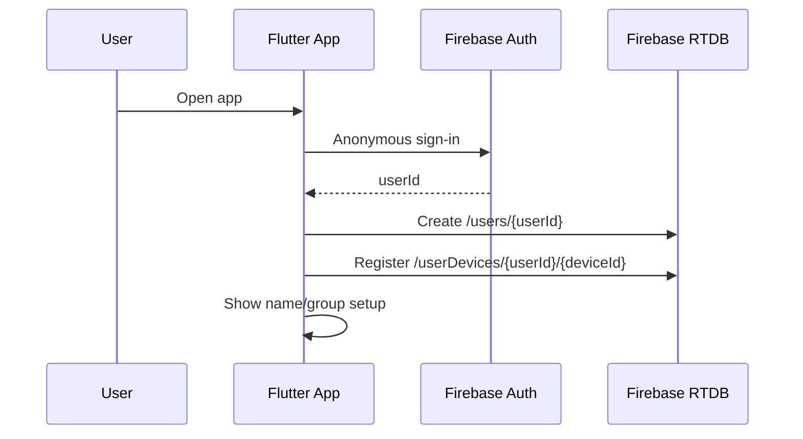

### Create Group

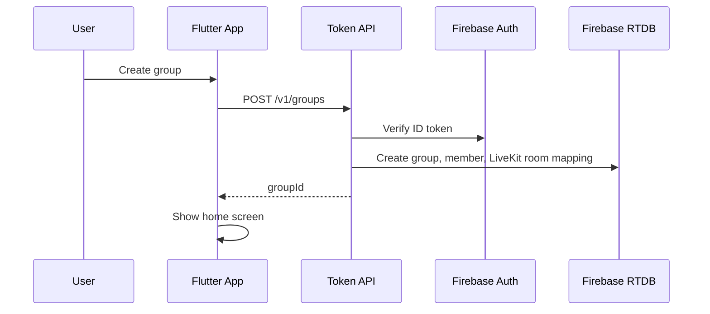

### Join Group

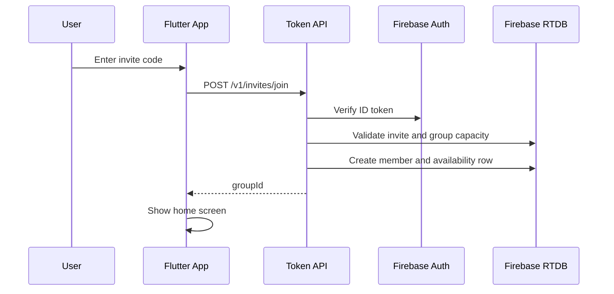

### Go Online

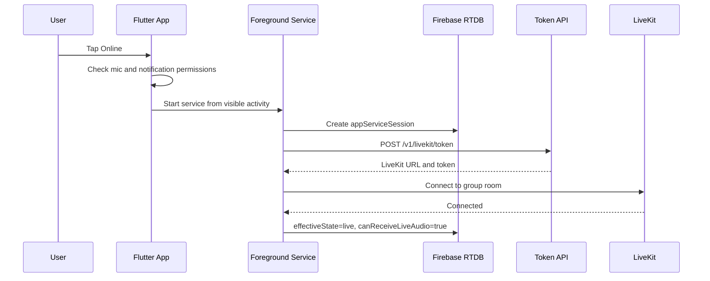

### Friend Live Notification

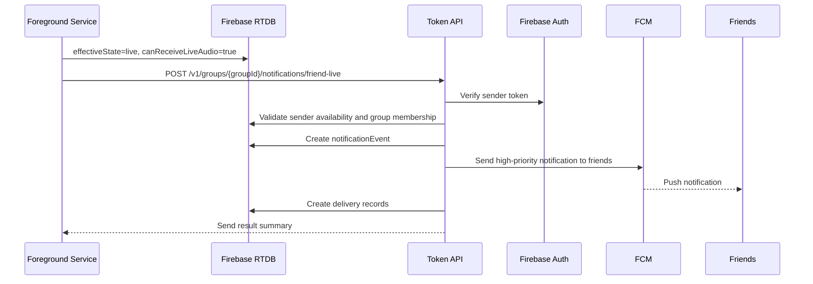

### Receive Voice While UI Closed

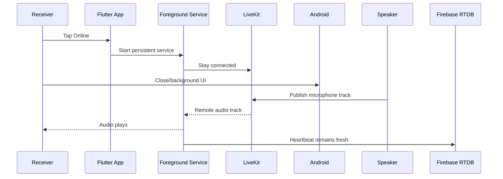

### Push To Talk

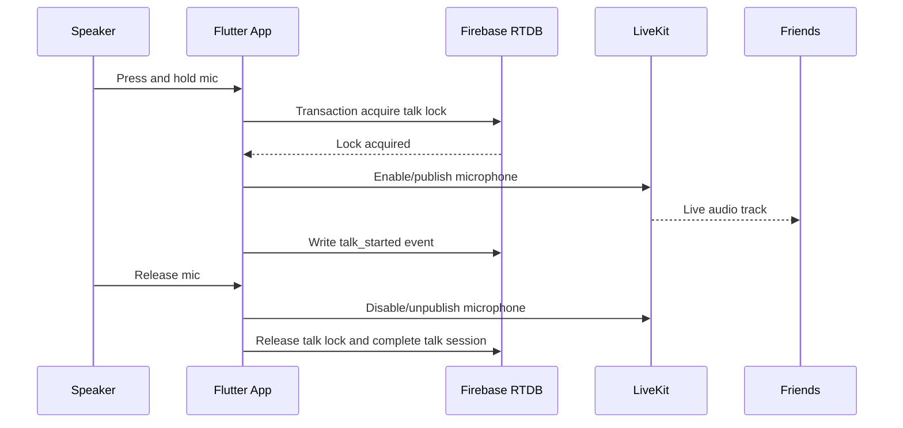

### Busy Case

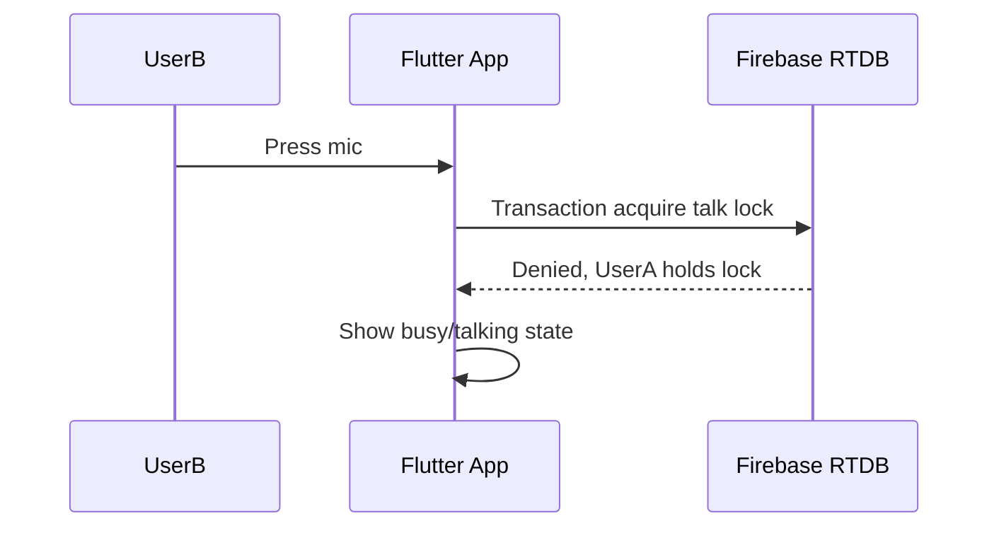

### Manual Nudge

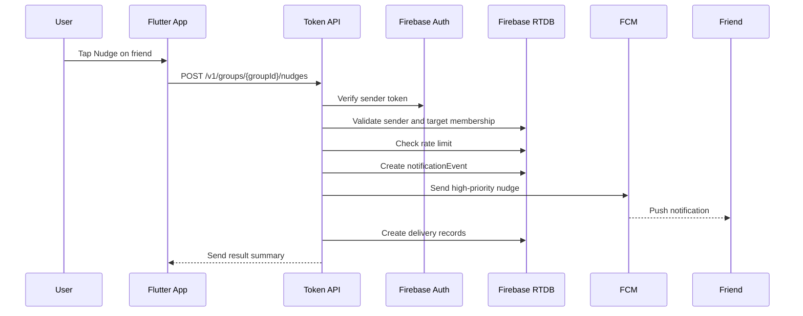

### Stale Service

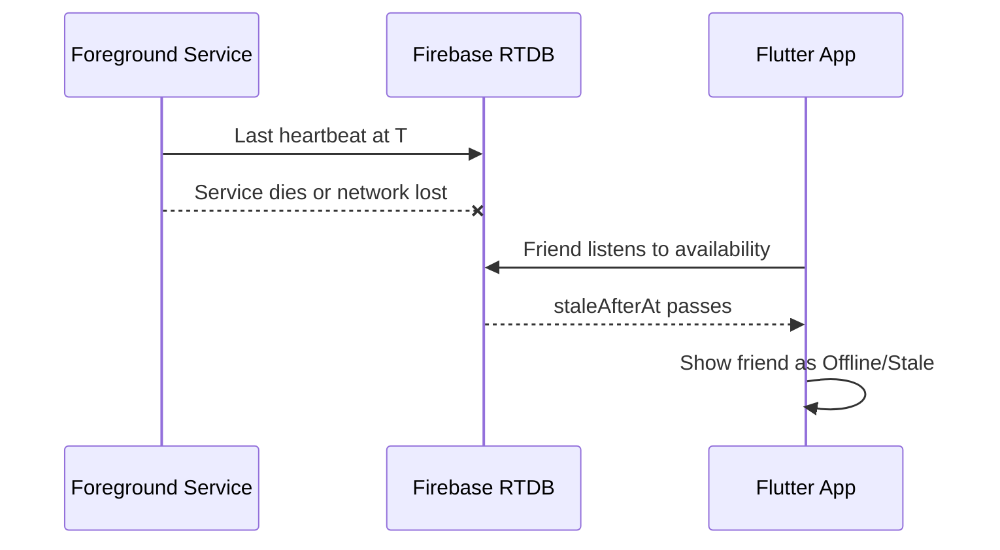

## LLD Combined Flows

### Flutter Layers

```txt
lib/
  app/
    app.dart
    router.dart
    theme/
      accent_palette.dart
      app_theme.dart

  features/
    auth/
      auth_controller.dart
      auth_repository.dart

    profile/
      profile_controller.dart
      profile_repository.dart

    group/
      group_controller.dart
      group_repository.dart
      invite_repository.dart

    home/
      home_screen.dart
      home_controller.dart
      friend_status_list.dart
      push_to_talk_button.dart

    settings/
      settings_screen.dart
      settings_controller.dart
      accent_color_picker.dart

    walkie/
      availability_controller.dart
      foreground_service_controller.dart
      livekit_room_controller.dart
      notification_controller.dart
      talk_lock_controller.dart
      audio_route_controller.dart
      heartbeat_controller.dart

  data/
    firebase/
      rtdb_paths.dart
      rtdb_client.dart
    api/
      token_api_client.dart
    models/
      user.dart
      group.dart
      member_availability.dart
      notification_event.dart
      notification_delivery.dart
      talk_lock.dart
      user_settings.dart

  platform/
    android_permissions.dart
    device_identity.dart
    foreground_task_entrypoint.dart
```

### Core Controllers

```txt
AuthController
  Ensures Firebase anonymous auth.

DeviceIdentity
  Creates stable install/device ID.
  Updates device metadata and FCM token.

GroupController
  Creates group, joins group, observes current group and members.

AvailabilityController
  Owns desired/effective state transition commands.
  Starts/stops online mode.

ForegroundServiceController
  Starts and stops Android foreground service.
  Sends commands between UI and service task.

LiveKitRoomController
  Requests token.
  Connects/disconnects LiveKit.
  Publishes/unpublishes microphone.
  Subscribes to remote audio.
  Emits connection state changes.

TalkLockController
  Acquires/releases Firebase talk lock transactionally.
  Writes talk session records.

NotificationController
  Calls friend-live notification endpoint after effective live state.
  Calls nudge endpoint from friend rows.
  Handles rate limit and send-result UI states.

HeartbeatController
  Writes service and availability heartbeat every 10 seconds.
  Computes staleAfterAt = now + 30 seconds.

SettingsController
  Reads/writes accent color and other settings.
```

### App Launch Flow

```txt
Open app
-> initialize Firebase
-> sign in anonymously if needed
-> load/create device ID
-> register user device
-> load user profile
-> load active group membership
-> load settings
-> show setup, group join/create, or home screen
```

### Go Online Flow

```txt
Tap Online
-> validate group membership
-> request RECORD_AUDIO if missing
-> request POST_NOTIFICATIONS if needed
-> warn if battery optimization is active
-> create serviceSessionId
-> start foreground service from visible activity
-> service writes appServiceSessions/{serviceSessionId}
-> service requests LiveKit token
-> service connects to LiveKit room
-> service subscribes to remote audio
-> service starts heartbeat
-> service writes memberAvailability effectiveState=live
-> service calls friend-live notification API
-> notification shows Online
```

### Friend Live Notification Flow

```txt
effectiveState becomes live
-> verify canReceiveLiveAudio=true
-> call POST /v1/groups/{groupId}/notifications/friend-live
-> backend validates sender is actually live
-> backend creates notification event
-> backend sends high-priority FCM to active friends
-> backend writes per-device delivery records
-> service records result in status event/log
```

### Nudge Flow

```txt
Tap Nudge on friend row
-> check target is active group member
-> call POST /v1/groups/{groupId}/nudges
-> backend validates sender and target membership
-> backend applies rate limits
-> backend creates notification event
-> backend sends high-priority FCM to target devices
-> backend writes per-device delivery records
-> app shows sent/rate-limited/error state
```

### Press Mic Success Flow

```txt
Touch down on mic
-> check desiredState=online
-> check effectiveState in [live, listening]
-> check mic permission
-> acquire talkLocks/{groupId} transaction
-> if acquired:
     set effectiveState=talking
     create talkSessions/{talkSessionId}
     enable microphone in LiveKit
     notify haptic feedback
-> while held:
     keep lock fresh or rely on expiresAt
-> touch up/cancel:
     disable microphone
     complete talk session
     release talk lock
     set effectiveState=live
```

### Press Mic Denied Flow

```txt
Touch down on mic
-> acquire talk lock transaction
-> transaction sees another active holder
-> do not enable microphone
-> show friend as Talking
-> optional short haptic denial
```

### Receive Audio Flow

```txt
Foreground service is running
-> LiveKit connected and subscribed
-> remote participant publishes mic track
-> LiveKit SDK receives track
-> audio plays through selected output
-> UI, if open, shows speaker as Talking
-> if UI is closed, foreground service keeps notification and heartbeat active
```

### Reconnect Flow

```txt
LiveKit connection state becomes reconnecting
-> write livekitConnectionState=reconnecting
-> set effectiveState=connecting unless currently talking
-> keep foreground service notification active
-> LiveKit reconnects
-> write livekitConnectionState=connected
-> write effectiveState=live/listening
-> if token expired and reconnect fails:
     request fresh token
     reconnect room
```

### Service Death/Stale Flow

```txt
Heartbeat stops
-> staleAfterAt passes
-> observers stop treating user as live
-> next app launch detects desiredState=online but no active service
-> show Needs setup/Reconnect
-> user can tap Online again
```

### Go Away Flow

```txt
Tap Away or notification action Away
-> if holding talk lock, release it
-> disable microphone
-> disconnect LiveKit
-> stop heartbeat
-> write desiredState=away
-> write effectiveState=away
-> write service stopped
-> stop foreground service notification
```

## LiveKit Room Behavior

Room strategy:

```txt
One persistent LiveKit room per group.
Room name: group_{groupId}
Participant identity: {groupId}:{userId}:{deviceId}
Participant name: displayName
```

When online:

```txt
Connect to room.
Subscribe to remote audio.
Do not publish microphone unless holding talk lock.
```

When talking:

```txt
Acquire Firebase talk lock first.
Enable/publish microphone.
Disable/unpublish microphone on release.
```

Recommended MVP microphone strategy:

```txt
Publish microphone only while talking.
Keep LiveKit room connected while online.
```

Reason:

- Keeps receive latency low.
- Avoids constant microphone capture.
- Keeps privacy expectations cleaner.

If talk startup feels too slow, evaluate pre-created muted local audio track in a later optimization.

## Security Plan

### Auth

MVP uses Firebase Anonymous Auth.

Upgrade path:

```txt
Link anonymous account to phone/email later if needed.
```

### Token Safety

LiveKit API secret must exist only on the backend.

Never store:

```txt
LiveKit API secret
raw LiveKit token in client-readable DB
raw invite code
```

### Firebase Rules Direction

Rules should enforce:

```txt
Users can write only their own user profile.
Users can write only their own device records.
Users can write only their own settings.
Users can read group data only if active member.
Users can write their own availability only if active member.
Users can create/update talk lock only if active member and online.
Only backend can create groups, invite records, LiveKit room mappings, token issuance audit records, notification events, and notification delivery records.
```

### Backend Validation

Every backend endpoint must:

```txt
Verify Firebase ID token.
Validate request payload with zod.
Check group membership for group operations.
Avoid leaking whether an invite code exists unless join succeeds/fails generically.
Rate-limit nudge requests.
Dedupe friend-live notifications during reconnect loops.
Clean up invalid FCM tokens after permanent send failures.
Log request ID, user ID, endpoint, and result.
```

## Deployment Plan

### VM Setup

Use one Oracle Cloud Always Free VM.

Install:

```txt
Docker
Docker Compose
Caddy
LiveKit server
Redis
Node token API
```

Recommended domains:

```txt
livekit.example.com
api.example.com
turn.example.com
```

LiveKit official VM setup expects:

```txt
80/tcp
443/tcp
7881/tcp
3478/udp
50000-60000/udp
```

### Container Layout

```txt
docker-compose.yaml
  livekit:
    image: livekit/livekit-server
    depends_on: redis

  redis:
    image: redis

  token-api:
    build: ./token-api
    env:
      LIVEKIT_API_KEY
      LIVEKIT_API_SECRET
      LIVEKIT_URL
      FIREBASE_SERVICE_ACCOUNT

  caddy:
    image: caddy
    ports:
      80, 443
```

### Secrets

Store on VM as environment variables or Docker secrets:

```txt
LIVEKIT_API_KEY
LIVEKIT_API_SECRET
FIREBASE_SERVICE_ACCOUNT_JSON
FIREBASE_DATABASE_URL
```

Do not commit secrets.

## Implementation Phases

### Phase 0: Background Audio Spike

Goal: prove the riskiest assumption.

Build only:

```txt
Flutter test app
LiveKit connect/disconnect
Foreground service
Two-device audio test
Heartbeat writes
FCM token registration sanity check
```

Exit criteria:

```txt
Audio plays while receiver app is foregrounded.
Audio plays while receiver app is backgrounded.
Audio plays while receiver screen is locked.
Receiver remains live while service notification is active.
Heartbeat expires correctly when service is killed.
Known unsupported states are documented in UI copy.
```

### Phase 1: Infrastructure

Build:

```txt
Oracle VM
LiveKit + Redis
Caddy TLS
Token API health endpoint
FCM Admin SDK send test
Firebase project
Firebase Auth and RTDB
```

Exit criteria:

```txt
Flutter app can get token from API.
Flutter app can connect to self-hosted LiveKit.
Two devices can join same room.
Backend can send one test FCM notification to a registered device.
```

### Phase 2: Auth, Group, Device

Build:

```txt
Anonymous auth
User profile
Device registration
FCM token registration
Group create
Invite create/join
Settings skeleton
```

Exit criteria:

```txt
Four users can join one private group.
Friend list loads from Firebase.
Accent color setting persists.
```

### Phase 3: Online/Away and Availability

Build:

```txt
Foreground service online mode
LiveKit room connection
Availability writes
Heartbeat
Friend-live notification send
Manual nudge notification send
Friend state display
Notification action: Away
```

Exit criteria:

```txt
Users see live/away/offline states correctly.
Friends receive notification when a member becomes live.
Users can nudge a friend and receive rate-limit feedback.
Stale users stop showing as live within 30 seconds.
Online notification is visible.
```

### Phase 4: Push To Talk

Build:

```txt
Talk lock transaction
Mic press/release
LiveKit microphone publish/unpublish
Talking/listening states
Talk session records
Busy denial
```

Exit criteria:

```txt
Only one user can talk at a time.
Other online users hear the speaker.
Busy users cannot publish mic.
Release always disables mic and releases lock.
Expired lock recovers.
```

### Phase 5: Polish and Reliability

Build:

```txt
Audio output preference
Haptics
Crashlytics
Permission checklist
Battery optimization warning
Connection error states
Basic diagnostics screen
```

Exit criteria:

```txt
Non-technical users understand why they are not live.
Common permission/network errors are visible and recoverable.
```

## Testing Plan

### Unit Tests

```txt
Availability state reducer
Talk lock decision logic
Settings validation
Invite code validation
API payload validation
Nudge rate-limit decision logic
Friend-live dedupe key generation
```

### Integration Tests

```txt
Firebase emulator for group/member/availability writes
Token API with mocked Firebase Admin
Talk lock transaction conflict
Token generation membership checks
Friend-live notification membership checks
Nudge notification target validation
Notification delivery record writes
```

### Device Tests

Use at least two real Android devices.

Test matrix:

```txt
App foreground -> receive audio
App background -> receive audio
Screen locked -> receive audio
Swiped from recents -> service behavior
Force-stop -> no receive, stale state
Network off/on -> reconnect behavior
Speaker presses while another talking -> denied
Talker releases -> mic disabled
Battery optimization enabled -> warning behavior
Notification permission denied -> online blocked/degraded
Friend goes live -> friends receive FCM notification
Repeated reconnect -> no duplicate live notification inside dedupe window
Nudge friend -> target receives FCM notification
Nudge spam -> sender receives rate-limit response
```

### Manual Acceptance Test

For four users:

```txt
All join same group.
All choose different accent colors.
All go online.
When each user goes live, the other friends receive a notification.
User A talks; B/C/D hear.
User B tries during A; B is denied.
User A releases.
User B talks; A/C/D hear.
User A nudges User C; User C receives a nudge notification.
User C goes away; C no longer receives.
User D closes UI but keeps service notification; D still hears.
User D force-stops app; D becomes stale/offline and does not hear.
```

## Observability

Log these events:

```txt
service_started
service_stopped
livekit_connected
livekit_reconnecting
livekit_disconnected
talk_started
talk_stopped
talk_denied_busy
availability_stale
permission_missing
token_issued
token_denied
friend_live_notification_sent
nudge_sent
nudge_rate_limited
notification_delivery_failed
```

Crashlytics keys:

```txt
user_id_hash
device_id
group_id
effective_state
service_state
livekit_connection_state
last_disconnect_reason
last_notification_event_id
last_notification_failure_code
```

Backend logs:

```txt
request_id
endpoint
user_id
group_id
status_code
latency_ms
error_code
```

Notification delivery metrics:

```txt
event_type
target_scope
recipient_users
target_devices
sent_count
failed_count
skipped_count
rate_limited_count
```

## Important Risks

### Background Receive Reliability

Risk:

```txt
Flutter foreground service setup may not keep LiveKit audio alive across all UI-closed/OEM states.
```

Mitigation:

```txt
Run Phase 0 before full build.
Keep persistent notification visible.
Ask user to disable battery optimization if needed.
Fallback to minimal Android service bridge if Flutter plugin route is insufficient.
```

### Free VM Reliability

Risk:

```txt
Oracle Always Free resources can be capacity constrained or require occasional maintenance.
```

Mitigation:

```txt
Keep deployment simple.
Use Docker Compose.
Document restore steps.
Export config backups.
```

### LiveKit Cloud Free Limits

Risk:

```txt
Always-on listening can exceed LiveKit Cloud free participant minutes.
```

Decision:

```txt
Use self-hosted LiveKit for MVP.
```

### Privacy Perception

Risk:

```txt
Always-online walkie-talkie apps can feel invasive if mic state is unclear.
```

Mitigation:

```txt
Show clear online notification.
Publish mic only while pressing talk.
Show visible Talking state.
Provide one-tap Away.
```

### Notification Delivery Limits

Risk:

```txt
FCM can accept a send but Android may still not display it because notification permission is denied, the device is offline, the app is force-stopped, OEM battery policy blocks delivery, or FCM deprioritizes abuse patterns.
```

Mitigation:

```txt
Use visible high-priority notifications only for time-sensitive live/nudge alerts.
Request notification permission during setup.
Store notification delivery attempts.
Rate-limit nudges.
Show setup warnings when notification permission is missing.
Document force-stop as unsupported.
```

## Product Decisions Locked For MVP

```txt
Android first.
Flutter app.
Self-hosted LiveKit.
Firebase Anonymous Auth.
Firebase Realtime Database.
One group visible in UI.
Max 4 active members.
One speaker at a time.
Live audio only, no replay.
Accent colors are predefined.
Friend-live notifications are mandatory when a user becomes effectively live.
Manual nudge notifications are mandatory.
Online mode requires persistent notification.
Force-stop is unsupported for live receive.
```

## Decisions To Revisit After MVP

```txt
Phone/email login.
Multiple groups in UI.
Voice replay clips.
LiveKit Cloud instead of self-hosted.
End-to-end encryption.
Admin moderation tools.
More advanced audio device routing.
```

## References

- LiveKit Flutter SDK: https://docs.livekit.io/transport/sdk-platforms/flutter/
- LiveKit tokens and grants: https://docs.livekit.io/frontends/reference/tokens-grants/
- LiveKit self-hosting: https://docs.livekit.io/transport/self-hosting/
- LiveKit VM deployment: https://docs.livekit.io/transport/self-hosting/vm/
- Android foreground service types: https://developer.android.com/develop/background-work/services/fgs/service-types
- Android foreground service restrictions: https://developer.android.com/develop/background-work/services/fgs/restrictions-bg-start
- Firebase Cloud Messaging no-cost product page: https://firebase.google.com/products/cloud-messaging
- Firebase Admin SDK send docs: https://firebase.google.com/docs/cloud-messaging/send/admin-sdk
- Firebase Android message priority: https://firebase.google.com/docs/cloud-messaging/android-message-priority
- FCM delivery behavior: https://firebase.blog/posts/2024/07/understand-fcm-delivery-rates/
