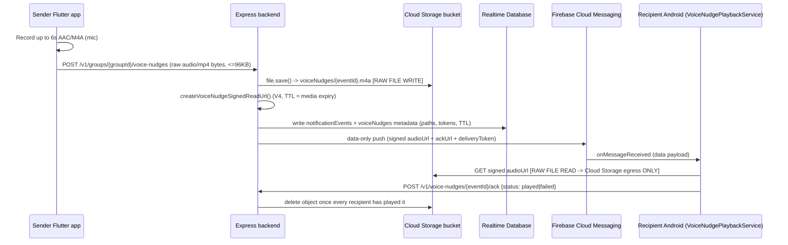

# Nudge Bandwidth Investigation

## Background

Firebase Console analytics for July show correlated bursty outbound traffic
on both the **Cloud Storage Bandwidth** graph and the backend's **Network /
Outbound Bandwidth** graph, concentrated around the same days (July 18–20).
This document explains why that happened, documents the full nudge flow end
to end, lists the structured logging in place, and tracks the signed-URL fix
that removes the double-egress path.

There are three nudge types. Only **Voice nudges** move media, so they are
the only type that can explain Cloud Storage bandwidth. **Push** and **Ring**
nudges are FCM data-only messages and never touch Cloud Storage.

## Full flow: Voice nudge, end to end (after signed-URL fix)



### Raw file vs. URL, hop by hop

| Hop | What actually moves | Where |
|---|---|---|
| Sender app → backend | **Raw audio bytes** (`audio/mp4`, ≤96KB, ≤6s) | `nudge_repository.dart` → `POST /v1/groups/:groupId/voice-nudges` |
| Backend → Cloud Storage | **Raw file write** | `voiceNudgeService.ts: createVoiceNudge` (`file.save`) |
| Backend → FCM → recipient | **Signed URL reference** (`audioUrl`) + `ackUrl` + opaque `deliveryToken`; no audio bytes in the push | `voiceNudgeService.ts: createVoiceNudge` |
| Recipient → Cloud Storage | **Raw file download** via V4 signed URL | `VoiceNudgePlaybackService.kt: downloadAudio` |
| Recipient → backend | Tiny ACK JSON only | `POST /v1/voice-nudges/:eventId/ack` |
| Legacy: recipient → backend `/audio` | **302 redirect** to a fresh signed URL (no audio body) | `resolveVoiceNudgeAudioRedirect` |

Audio is **never** placed in Realtime Database and is **never** base64-encoded.
RTDB only stores small metadata: `storagePath`, `expiresAt`, delivery token
hashes, and lifecycle state (`pending → sent → downloaded → played`).

Storage security rules remain closed to clients; V4 signed URLs authenticate
access without opening the bucket.

## Root cause of "identical bandwidth from storage and server" (resolved)

Previously, every voice-nudge playback used a **proxy**:

```
Recipient  ──GET audio──▶  Backend  ──file.download()──▶  Cloud Storage
Recipient  ◀─send(audio)── Backend
```

That produced **two egress events of the same byte size** per playback:

1. **Cloud Storage → backend**: Cloud Storage (Admin SDK) egress.
2. **Backend → recipient device**: backend / Cloud Run outbound egress.

### Fix applied

Recipients now download **directly from Cloud Storage** using a short-lived
V4 signed URL embedded in the FCM payload. Backend server outbound for the
audio body is eliminated for new clients.

Compatibility: `GET /v1/voice-nudges/:eventId/audio` no longer proxies bytes;
it validates the delivery token and returns **302 Location: signed URL**.
Android follows redirects without forwarding `x-one-one-delivery-token` to
GCS (which would break signature verification).

Expected analytics after deploy + updated APK:

- **Cloud Storage bandwidth**: remains (device ↔ Storage downloads).
- **Backend / network outbound**: drops for voice audio (only tiny ACK /
  redirect responses remain).

## Logging (unchanged checkpoint scheme)

Structured logs use `checkpoint` + `category` (`expected` | `unexpected`).
After the signed-URL change, `VOICE-NUDGE-BE-04` / `05` record
`egress: "signed_url_redirect"` when the compatibility redirect is used;
primary delivery no longer hits that path because FCM already carries the
signed URL.

| Checkpoint | Level | Meaning |
|---|---|---|
| `VOICE-NUDGE-BE-01` | info | Upload accepted, about to write to Cloud Storage |
| `VOICE-NUDGE-BE-02` | info | Audio stored in Cloud Storage |
| `VOICE-NUDGE-BE-03` | info | Dispatched via FCM with `deliveryMode: "signed_url"` |
| `VOICE-NUDGE-BE-04` | info | Compatibility path: signed URL issued for redirect |
| `VOICE-NUDGE-BE-05` | info | Compatibility path: 302 redirect response sent |
| `VOICE-NUDGE-BE-06` | info/warn | Playback ack received |
| `VOICE-NUDGE-BE-07` | info | Cloud Storage object deleted after every recipient played |
| `VOICE-NUDGE-BE-08` | info | Cloud Storage object purged (no recipients / expired) |
| `VOICE-NUDGE-BE-W1`–`W3` | warn | No recipients / expired / bad token |
| `VOICE-NUDGE-BE-E1`–`E3` | error | Storage write / RTDB rollback / signed URL failure |

Frontend upload logs: `[OneOneNudge][DART-01/02/E1]` in `nudge_repository.dart`.

## Checklist

- [x] **Confirm bandwidth routing between server and storage** — root cause
  was the Admin SDK download + Express re-send proxy.
- [x] **Backend logging with error vs. expected separation**
- [x] **Frontend logging** for voice upload size/timing
- [x] **Document full nudge flow**
- [x] **Signed URL delivery** — FCM `audioUrl` is a Cloud Storage V4 signed
  read URL (TTL aligned with media `expiresAt`).
- [x] **Remove backend audio proxy** — `/audio` redirects instead of buffering
  and re-sending bytes; Android downloads GCS URLs without the delivery-token
  header and handles redirects safely.
- [ ] **Ship backend + Android APK** and confirm Cloud Storage bandwidth
  continues while server outbound for voice audio drops.
- [ ] **Correlate logs** after deploy (`deliveryMode: "signed_url"`, rare
  `signed_url_redirect` only from older clients).

### Fix options status

1. **Stream instead of buffer** — superseded: proxy path removed; no audio
   buffer through Express for playback.
2. **Signed URL to recipient** — **implemented**.
3. **Cache at the backend** — not needed for playback after signed URLs
   (backend no longer downloads the object for delivery). Multi-recipient
   still means N GCS downloads (one per device); that is correct and minimal.

## Reference: nudge types and paths

### Nudge types

| Type | Trigger | Media | Storage used |
|---|---|---|---|
| Push | `nudge_screen.dart` → "Push" | None (data-only FCM + response endpoints) | No |
| Ring | `nudge_screen.dart` → 3/5/10s ring | None (native PCM tone synthesized on recipient device) | No |
| Voice | `nudge_screen.dart` → hold-to-record | Raw AAC/M4A audio, ≤96KB, ≤6s | Yes (`voiceNudges/{eventId}.m4a`) |

### Cloud Storage paths

| Path | Purpose | Lifecycle |
|---|---|---|
| `voiceNudges/{eventId}.m4a` | Private voice nudge audio | Deleted once every recipient plays it, or purged on no-recipients/expiry; bucket lifecycle rule is the final 1-day safety net |

### Realtime Database paths (metadata only, no audio)

| Path | Purpose |
|---|---|
| `notificationEvents/{groupId}/{eventId}` | Event record (`nudge` / `ring_nudge` / `voice_nudge`) |
| `notificationDeliveries/{eventId}/{userId}_{deviceId}` | Per-device delivery state |
| `voiceNudges/{eventId}` | `storagePath`, `expiresAt`, `voiceNudgeState`, `deliveries/*` |
| `voiceNudges/{eventId}/deliveries/{deliveryId}` | Token hash + delivery state per device |
| `nudgeResponses/{eventId}/{responderUserId}` | Accept/decline/snooze |
| `statusEvents/{groupId}/*` | Analytics events (`nudge_sent`, `nudge_accept`, …) |
| `userDevices/{userId}/*` | FCM registration per device (read by backend) |
| `groupMembers/{groupId}/*` | Recipient resolution |

### Related source files

- App: `app/lib/features/nudges/ui/nudge_screen.dart`,
  `app/lib/features/nudges/data/nudge_repository.dart`,
  `app/lib/features/nudges/data/android_voice_nudge_bridge.dart`,
  `app/lib/features/identity/ui/identity_home_screen.dart`
- Android native: `VoiceNudgeMessagingService.kt`,
  `VoiceNudgePlaybackService.kt`
- Backend: `backend/src/routes/notificationRoutes.ts`,
  `backend/src/notifications/voiceNudgeService.ts`,
  `backend/src/notifications/voiceNudgeValidation.ts`,
  `backend/src/firebase/storage.ts`, `backend/src/firebase/messaging.ts`
- Related docs: `requirements/android-nudge-delivery.md`,
  `requirements/nudge-action-processing.md`
